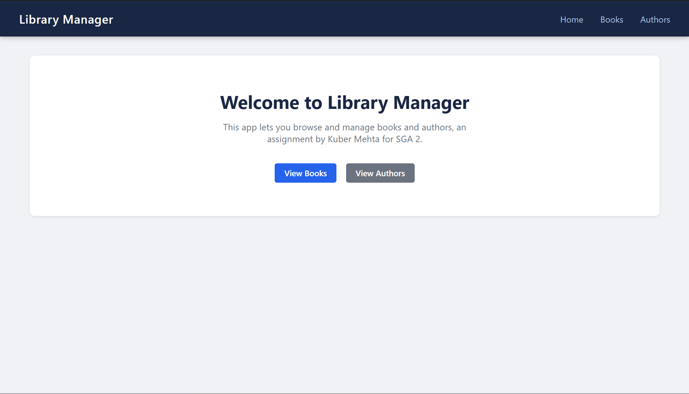
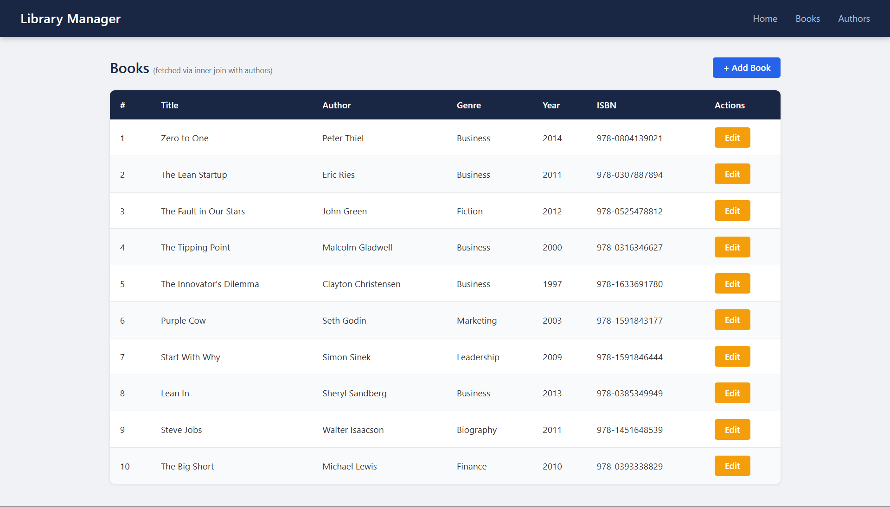
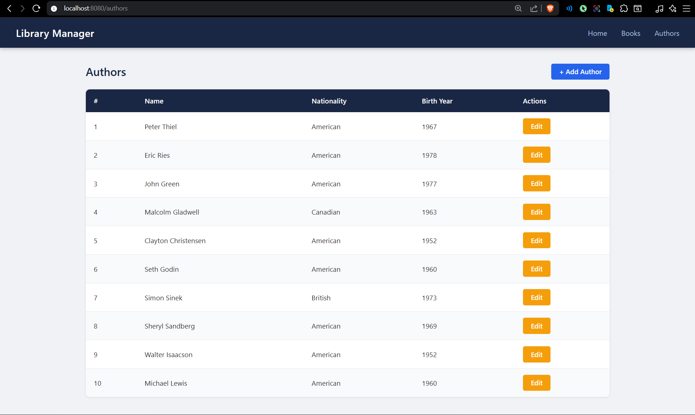
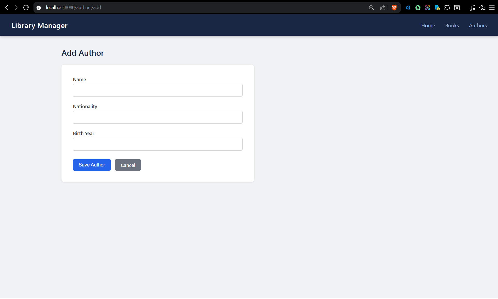
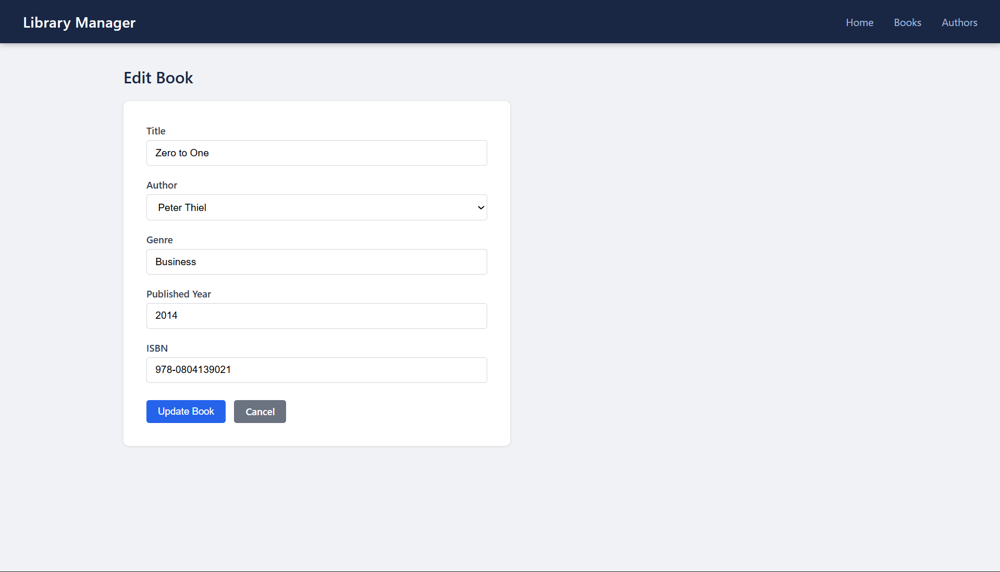
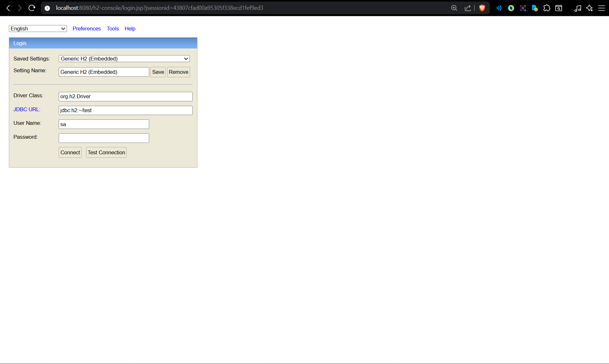

# Building a Library Manager App from Scratch with Spring Boot

This repository serves as a submission for SGA 2 by Kuber Mehta for Building Database Applications, building a Library Manager system from scratch in Spring Boot.



---

## Approach

The application manages two entities: Author and Book. A book belongs to one author (Many-to-One), and an author can have many books (One-to-Many).

I picked some books and authors I liked and the ones that allowed me to represent a realistic, well-defined relationship.

The stack we're using is Spring Boot 2.7 with an H2 in-memory database, JSP views with JSTL, and JPA/Hibernate for ORM. The project is packaged as a WAR with embedded Tomcat so it can be run directly with `mvn spring-boot:run`.

---

## E-R Design

```
Author (one) ----< Book (many)
```

**Author table (authors):**
- id (PK, auto-generated)
- name (NOT NULL)
- nationality
- birth_year

**Book table (books):**
- id (PK, auto-generated)
- title (NOT NULL)
- genre
- published_year
- isbn (UNIQUE)
- author_id (FK -> authors.id)

The `@OneToMany` for the Authors and `@ManyToOne` for the Books have a bidirectional relationship. The unique constraint in this problem is on `isbn`, which is used to handle integrity violation.

---

## Implementation Details

### Populate Database

The `DataInitializer` class implements `CommandLineRunner` and runs on startup. Doing this we can insert 10 authors and 10 books using the repo layer.





---

### Create Operation

Controller method in `BookController` handles POST commands in `/books/add`. It receives the form fields via `@ModelAttribute` and the selected author ID via `@RequestParam`, fetches the Author, sets it on the book.

If a `DataIntegrityViolationException` error is thrown, the error message is added to the model and the form is re-rendered. The same idea applies to `AuthorController` for POST `/authors/add`.




---

### Read Operation

The books list page calls `bookService.getAllBooksWithAuthors()`, which calls the custom JPQL query in `BookRepository`:

```java
@Query("SELECT b FROM Book b INNER JOIN b.author a")
List<Book> findAllBooksWithAuthors();
```

`INNER JOIN` makes sure that only books that have an associated author are returned. The result is bound to the JSP view and rendered in a table showing title, author name, genre, year, and ISBN.

---

### Update Operation

Clicking Edit on any row redirects the user to `/books/edit/{id}` or `/authors/edit/{id}`. The controller fetches the existing entity, adds it to the model, and renders the edit form with fields pre-filled. For the book edit form, the author dropdown pre-selects the current author using a JSTL conditional:

```jsp
<option value="${a.id}" <c:if test="${book.author != null && book.author.id == a.id}">selected</c:if>>
```

On POST, the controller makes it so the ID is on the model object before saving, so Hibernate performs an UPDATE instead of INSERT.



---

## Testing

We wrote comprehensive tests for this project too. The repo tests use `@DataJpaTest` which have a slice context with H2. They test save, findById, the custom inner join query, and the behavior that books without an author are excluded from the INNER JOIN result.

Service tests use `@ExtendWith(MockitoExtension.class)` and Mockito. They test that the service delegates correctly and verify interactions.

The entire set of tests can be run with:

```
mvn test
```

---

## H2 Console

The H2 in-memory console is available at `http://localhost:8080/h2-console` while the app is running (JDBC URL: `jdbc:h2:mem:librarydb`, username: `sa`, no password).



---

## Challenges

1. **Author dropdown in the book form** - `@ModelAttribute` only handles flat form fields, so it chokes on nested entities like `Author`. The fix was to pull the author ID in as a plain `@RequestParam Long authorId` and fetch the entity manually in the controller.
2. **Pre-selecting the author in the edit form** - used a JSTL `c:if` tag to check each dropdown option against the current book's author ID as it loops through.